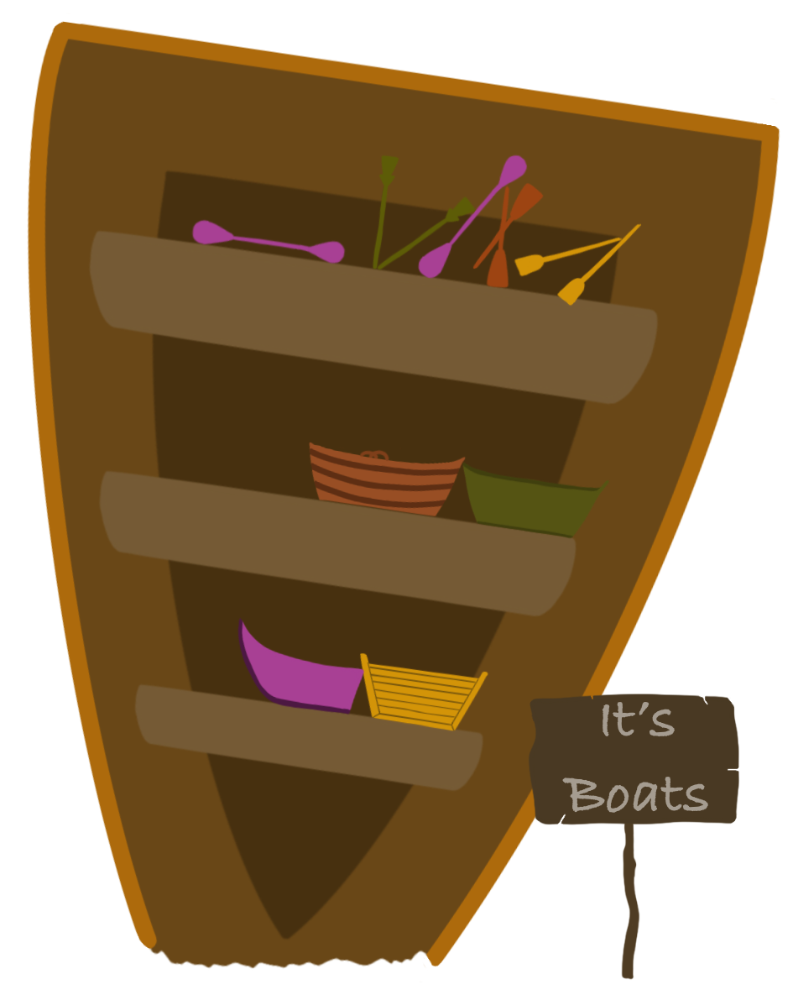

# Sea of Friends

A small fishing MMO made for [Honest Jam 5](https://itch.io/jam/honest-jam-5) in about a week.

[Play the game on itch.io](https://kuviman.itch.io/sea-of-friends)

## Controls

- Left click to fish, left click to reel when fish bites
- Right click to move
- Left click on fish in the inventory to drop it, or to sell it when near a fish shop
- Left click on a boat shop to buy/upgrade your boat
- Right click on water when having a boat to board your boat
- Right click on land when near it to get off your boat

## Goal of the game

- Explore
- Catch all the different types of fishes

## Credits

- kuviman - Programming
- Nertsal - Programming
- badcop - Programming, Level Design, Music, Sfx
- Mikky - Art
- [Some free models/audio samples](credits.txt)
